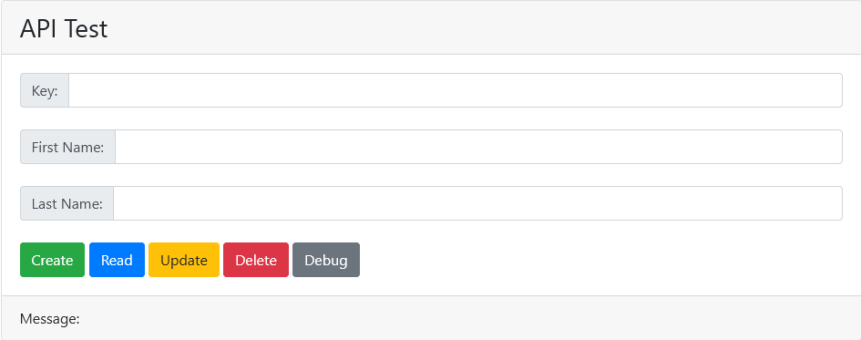

# FullStack Example

This CRUD App can manipulate a database which includes a key and a pair of names, as follows:

___

## Implementation

One of the fancy part of web app is that it is seperated by layers.

- The top layer is [frontend](./frontend), which utilises the [APIs](./docs) provided by backend. When implementing [frontend](./frontend), we can assume that all the [APIs](./docs) have already been implemented.
- The middle layer is the [backend](./backend), which utilises the functions in [Model layer](./backend/dbms) to manipuate the database. When implementing the [backend](./backend), we assume that all the functions in [Model layer](./backend/dbms) have already been implemented.
- The bottom layer is [Model layer](./backend/dbms), which includes the implementation of the database.